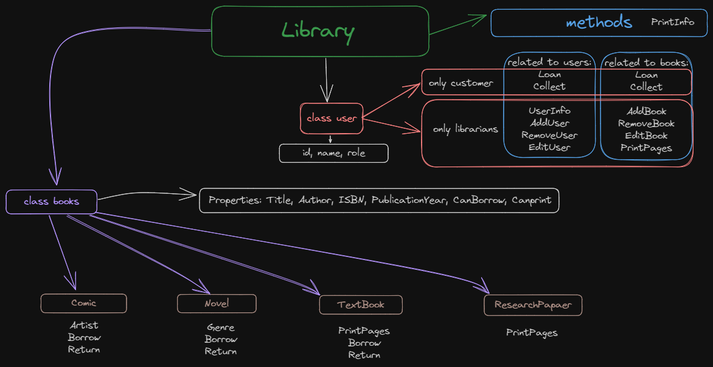

# Assignment: Library Management System

Library Management System as a C# console application.  
The purpose of this assignment is to key principles of Object-Oriented Programming:  

- Encapsulation
- Abstraction
- Inheritance
- Polymorphism

## Workflow:

## Console Results

- Notice that when a result displays as "this is not found", "the option is only for librarians", etc. Is because I called functions to fail on purpose to see the results.

### Screenshots:

 

## Description

A library has books and users. Users can be either cutomers or librarians. Librarians can add or remove books from the library and also can issue books to customers. Customers can request to borrow or return books. Also, library can have different types of books (Comic, Novel, TextBook, ResearchPaper) as well.

Your job is to model this system using classes, interfaces, and/or abstract classes as you see fit.

## Features

**Notes:** These are the basic features. You could add more properties/methods if they make your application more manageable.

1. `Library` should manage the collection of books, customers, and librarians. This class should have at least following methods:
   - Find, PrintInfo, PrintPages, Add, Remove, Edit books
   - Loan, Collect books from customers.
   - Find, Add, Remove, Edit people.
2. `Person` has properties such as Name, Role and ID. `Customer` and `Librarian` should inherit from this class and have additional properties/features:
   - Only `Customer` can Borrow and Return books.
3. `Book` has properties like Title, Author, ISBN, PublicationYear, CanBorrow, and CanPrint. To simplify the logic, we can consider each book as an unique record with unique ISBN in the `Library`. In addition, `Book` has `PrintInfo` method to print information about each book (uses `Console.WriteLine`). `Comic`, `Novel`, `TextBook`, and `ResearchPaper`should inherit properties from `Book` and have additional properties/features:
   - `Comic` has `Artist`, `Novel` has `Genre`
   - `Comic`, `Novel`, `TextBook` can be borrowed, but `ResearchPaper` cannot. If books are borrowable, they should have both `Borrow()` and `Return()` method
   - `TextBook`, and `ResearchPaper` can be printed (to certain amount of pages), but `Comic`, `Novel` cannot. The `PrintPages(int startPage, endPage)`method uses `Console.WriteLine` to inform the start page and end page to be printed, in case the amount of to-be-printed pages do not exceed the maximum allowed pages.
   - `Comic`and `Novel` should have different implementations of `PrintInfo()` with extra information about the extra properties, while `TextBook`, and `ResearchPaper` have default implementation.

## Advanced (optional) features

1. Implement a feature that allows librarians to conduct dynamic searches for books based on user-defined criteria. Create a method named `SearchBooksByCriteria` that accepts a dictionary of property names and search values. Use Reflection to dynamically inspect book properties and filter books based on the provided search criteria.
2. Come up with a strategy to modify the `Library` and any other class that we can secure our application with authentication feature. Only when login as customer, they can borrow and return books, and edit/delete their own profile. Only when login as librarian, they can edit/delete any profile, or create a new librarian. _Hints:_ have field `_currentUser`, method to log in (also log out if necessary).

## Requirements

1. Encapsulation: Use proper encapsulation for the fields in your classes. Use access modifiers to limit the access to the class members.
2. Abstraction: Use abstract classes/interfaces where necessary. Think about what methods are common to certain objects and could be abstracted into a superclass or interface.
3. Inheritance: Make use of inheritance. There should be a clear hierarchy and use of both base and derived classes.
4. Polymorphism: Your program should utilize polymorphism, allowing objects to decide which methods should be invoked.
5. `Program.cs` should only initialize the instance of Library. We should not directly create instances of other classes, but work with them via library's methods.
